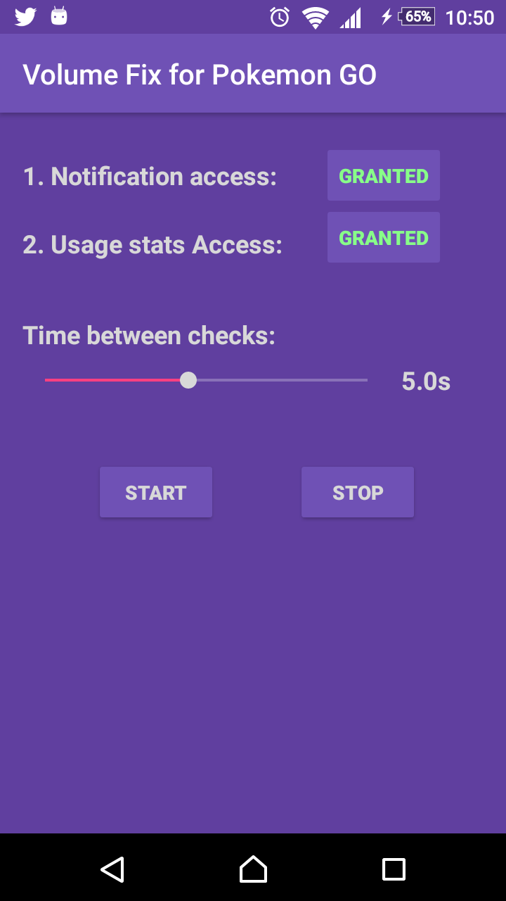

# PoGOAudioFix

An Android app which *somewhat* fixes Pokemon GO lowering the volume of other apps.

## How it works
The app monitors if Pokemon GO switches to the foreground by looking at Android's app usage statistics (this is important to note if you worry about getting (shadow-)banned: it's not interacting with the game directly!). Each time this happens, it checks for currently playing media sessions and pauses/unpauses them in such quick succession that it should not be noticeable by the user. Due to Android's permission system, the app needs two permissions: *access to notifications* (grants ability to alter media playback) and *access to usages statistics*. I did not have much time to test its long-term behavior so some issues may arise.

## Installation
Download the APK [here](apk/pogoaudiofix_1.0.apk) and simply open it on your mobile device or build the project yourself.

## Screenshot

## License
You are free to copy, alter and use the code as you see fit.
